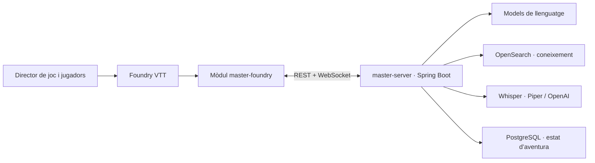

AI Game Master és un motor d’orquestració amb IA per dirigir partides a **Foundry VTT**. El projecte combina el servidor `master-server` (Spring Boot) amb el mòdul `master-foundry` (TypeScript): el mòdul aporta la interfície i el context del món; el servidor coordina la generació, la recuperació de coneixement, la narració i l’àudio.

Tria una de les dues parts principals:

- [Documentació **Funcional**](funcional/): què pot fer el sistema i com fer-lo servir com a director de joc.
- [Documentació **Tècnica**](tecnica/): arquitectura i detalls útils per desenvolupar o mantenir el projecte.
- [Punts de millora](millores/): auditoria i propostes pendents.

Els detalls de cada component i de les connexions es descriuen a la [visió general de l’arquitectura](tecnica/arquitectura/).

Fonts: [AGENTS.md](https://github.com/giro-dev/AI-game-master/blob/main/AGENTS.md), [MasterServerApplication.java](https://github.com/giro-dev/AI-game-master/blob/main/master-server/src/main/java/dev/agiro/masterserver/MasterServerApplication.java), [main.ts](https://github.com/giro-dev/AI-game-master/blob/main/master-foundry/src/main.ts).
