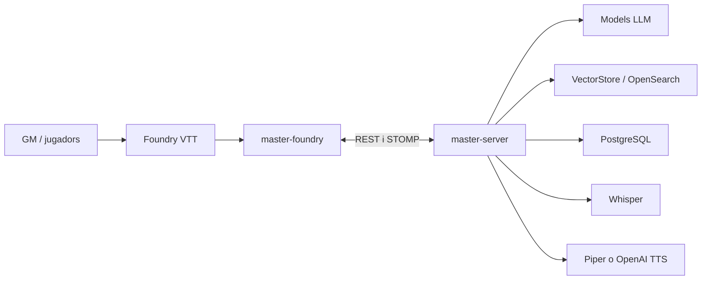
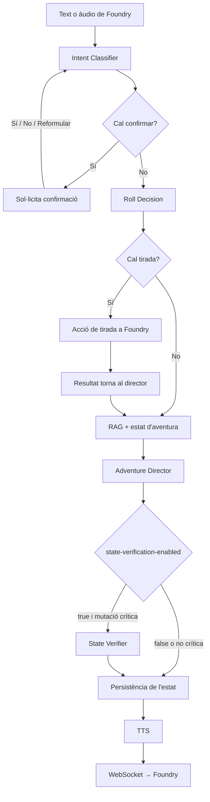

## Context del sistema

El servidor `master-server` (Spring Boot) orquestra els models, el RAG, l’estat i els serveis d’àudio. El mòdul `master-foundry` aporta la UI de Foundry, la introspecció del sistema i el context del món. Es comuniquen per REST i STOMP sobre WebSocket; el servidor també registra un endpoint WebSocket natiu.

## Torn del director

El flux concret classifica primer la intenció. Si cal confirmació, el servidor espera la resposta; si l’acció requereix una tirada, retorna una acció de Foundry i processa el resultat en un torn posterior. En la resposta narrativa, el director consulta el RAG, invoca el client amb les eines d’estat i tirades, persisteix les actualitzacions i programa síntesi d’àudio.

La comprovació d’estat només corre si `state-verification-enabled` està habilitat i la resposta conté mutacions crítiques; el valor inicial configurat és `false`. La decisió de tirada pot aparèixer com a etapa anterior o com a eina disponible per al director, segons el camí de petició.

Fonts: [guia d’arquitectura del repositori](https://github.com/giro-dev/AI-game-master/blob/main/.agents/skills/architecture/SKILL.md), [AdventureDirectorService](https://github.com/giro-dev/AI-game-master/blob/main/master-server/src/main/java/dev/agiro/masterserver/service/AdventureDirectorService.java), [WebSocketConfig](https://github.com/giro-dev/AI-game-master/blob/main/master-server/src/main/java/dev/agiro/masterserver/config/WebSocketConfig.java), [application.yml](https://github.com/giro-dev/AI-game-master/blob/main/master-server/src/main/resources/application.yml).
