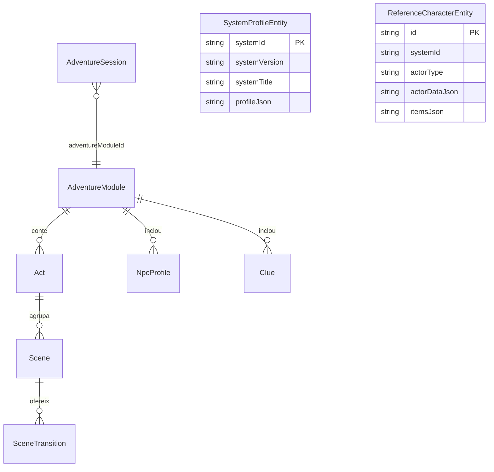

El model relacional persistit combina les entitats d’aventura i sessió amb registres de perfils de sistema i actors de referència. Hibernate té `ddl-auto: update` a la configuració del servidor.

| Classe | Dades destacades |
|---|---|
| `AdventureModule` | Títol, sistema, sinopsi, món i col·leccions d’actes, PNJ i pistes. |
| `Act` | Títol, descripció, ordre, escenes i condicions d’entrada. |
| `Scene` | Text per llegir, notes del GM, pistes/PNJ disponibles i transicions. |
| `SceneTransition` | ID de l’escena de destí i condició interpretada pel director. |
| `NpcProfile` | Personalitat, secrets, objectius, actitud i dades de veu. |
| `Clue` | Títol, descripció, condició de descoberta i indicador de pista principal. |
| `AdventureSession` | Aventura/món, escena i acte actuals, participants, pistes, PNJ, decisions, tensió i timestamps. |
| `SystemProfileEntity` | Perfil complet serialitzat en `profileJson`, identificat pel sistema. |
| `ReferenceCharacterEntity` | Actor i objectes d’exemple serialitzats, identificats per sistema i tipus d’actor. |

`AdventureSession` desa `adventureModuleId` com a identificador de cadena; el model no declara una associació JPA directa amb `AdventureModule`. La llista de llibres del pipeline, en canvi, s’administra amb un registre en memòria i no és una entitat JPA d’aquest model.

Fonts: [AdventureModule](https://github.com/giro-dev/AI-game-master/blob/main/master-server/src/main/java/dev/agiro/masterserver/model/AdventureModule.java), [AdventureSession](https://github.com/giro-dev/AI-game-master/blob/main/master-server/src/main/java/dev/agiro/masterserver/model/AdventureSession.java), [Act](https://github.com/giro-dev/AI-game-master/blob/main/master-server/src/main/java/dev/agiro/masterserver/model/Act.java), [Scene](https://github.com/giro-dev/AI-game-master/blob/main/master-server/src/main/java/dev/agiro/masterserver/model/Scene.java), [NpcProfile](https://github.com/giro-dev/AI-game-master/blob/main/master-server/src/main/java/dev/agiro/masterserver/model/NpcProfile.java), [Clue](https://github.com/giro-dev/AI-game-master/blob/main/master-server/src/main/java/dev/agiro/masterserver/model/Clue.java), [SystemProfileEntity](https://github.com/giro-dev/AI-game-master/blob/main/master-server/src/main/java/dev/agiro/masterserver/entity/SystemProfileEntity.java), [ReferenceCharacterEntity](https://github.com/giro-dev/AI-game-master/blob/main/master-server/src/main/java/dev/agiro/masterserver/entity/ReferenceCharacterEntity.java), [IngestionPipeline](https://github.com/giro-dev/AI-game-master/blob/main/master-server/src/main/java/dev/agiro/masterserver/pdf_extractor/IngestionPipeline.java), [application.yml](https://github.com/giro-dev/AI-game-master/blob/main/master-server/src/main/resources/application.yml).
